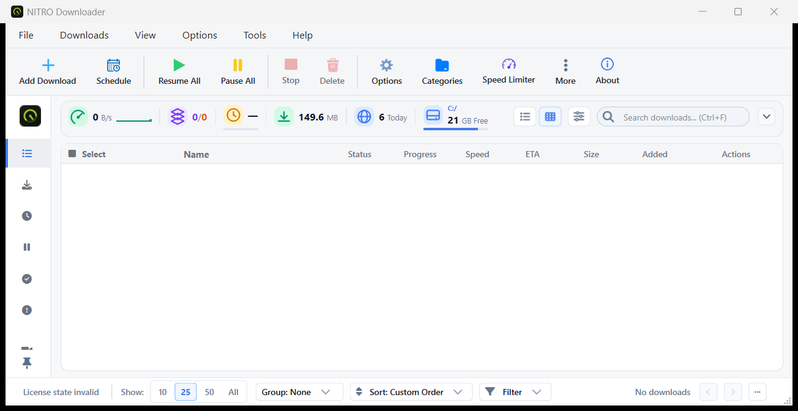

# NITRO Downloader

NITRO Downloader is a fast, multi-segment download manager for Windows. It
accelerates regular file downloads and adds a dedicated video-download
workflow (YouTube and 1000+ other sites) through a companion browser
extension.

## Features

- Multi-segment parallel downloads for faster speeds
- Pause/resume, even after a crash or reboot
- Browser extension: right-click "Download with NITRO Downloader", an
  in-page download button on video sites, and a resolution/format picker
  (144p-4K, audio-only)
- Category-based organization, scheduling, speed limiting, and a download
  queue
- Runs quietly in the system tray with a global show/hide shortcut

## Download

Grab the latest Windows installer from the
[Releases page](https://github.com/insightarchive/nitro-downloader-releases/releases/latest).

## Licensing

NITRO Downloader is free to try. A license (Personal, Duo, or Family tier)
can be purchased directly from within the app via the "Buy Now" button.

---

This repository hosts only compiled release binaries — no source code.
